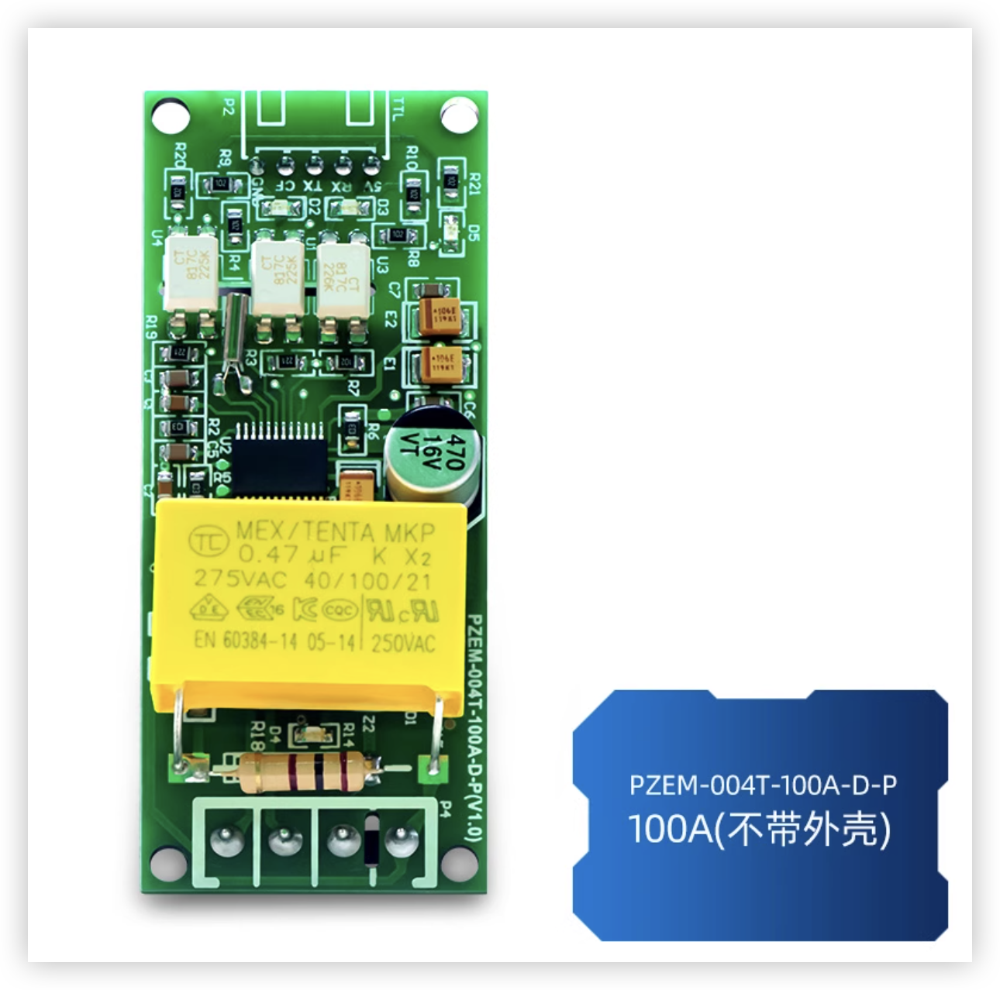
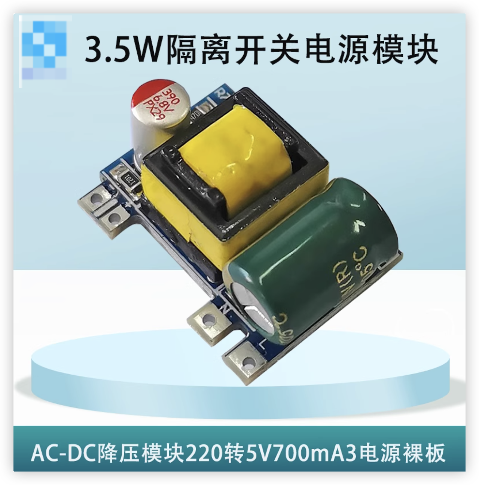
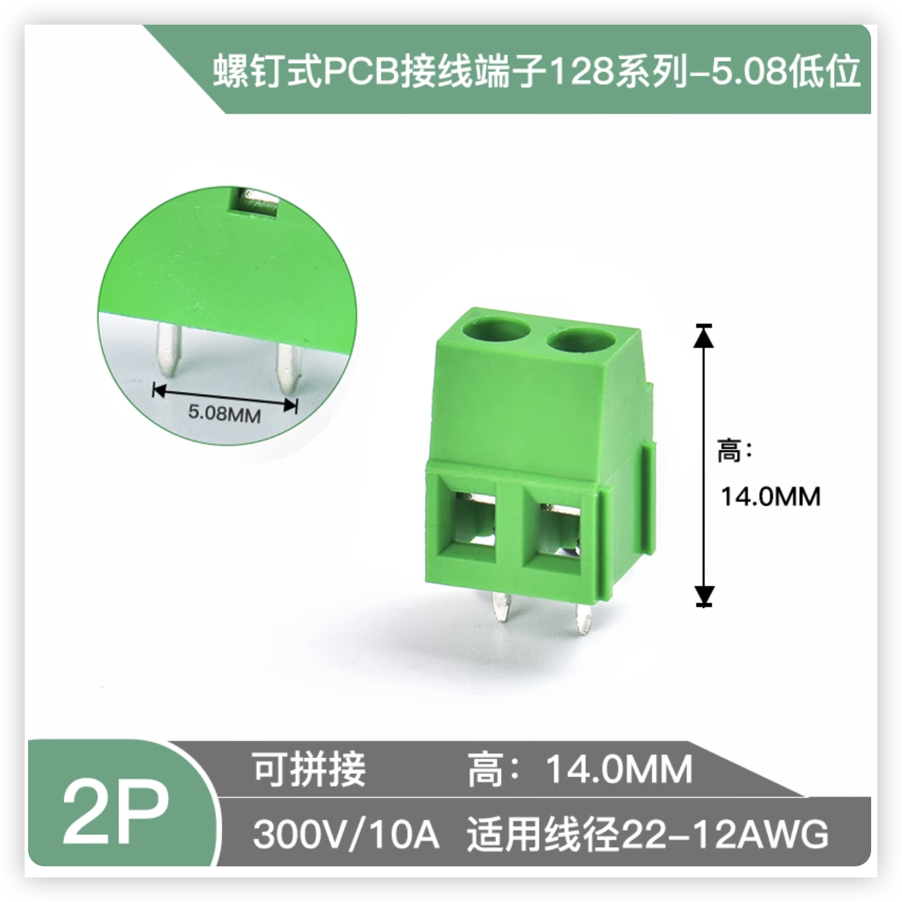
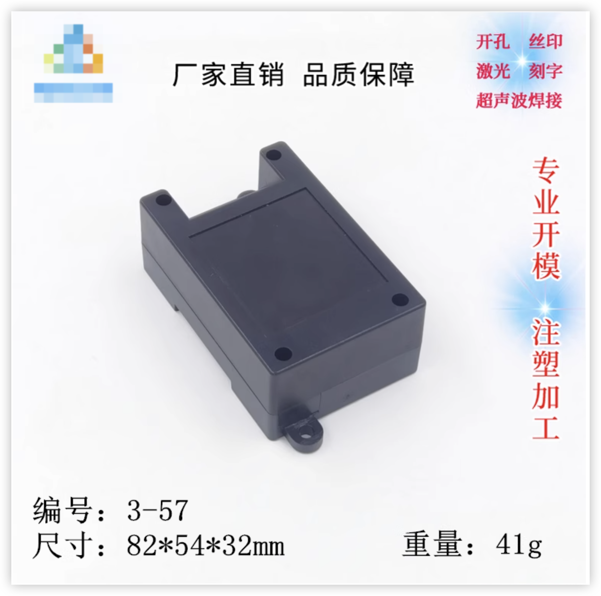
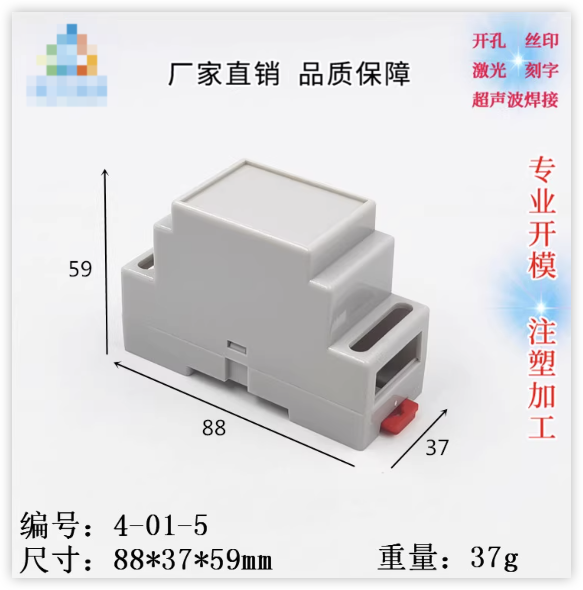
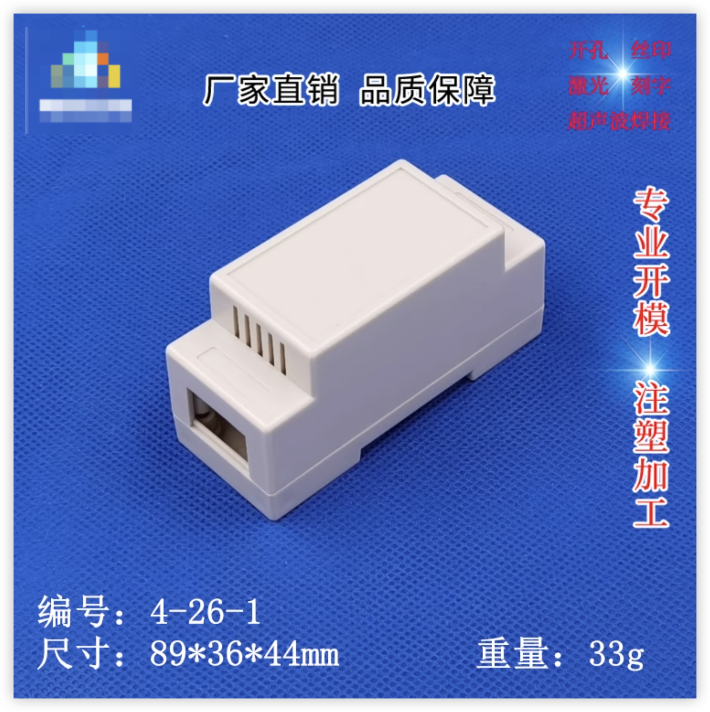

# PZEM-004T V3.0 + ESP8266 + Home Assistant 电量统计

之前一直淘宝卖的成品diy电量统计模块，现在不想整了，发出来各位自行diy吧。

使用、安装可以看淘宝详情页，懒得折腾了。[淘宝链接](https://item.taobao.com/item.htm?ft=t&id=626177722402&spm=a21dvs.23580594.0.0.4fee645efPzoFB)

---

## 📦 硬件清单
- PZEM-004T V3.0 电量计模块（5pin）
- ESP-WROOM-02
- 交流电流互感器（随 PZEM 模块附带）
- 2.54mm排针
- 外壳
- PCB板（根据外壳不同选择打板文件）
- 220v转5V电源模块
- 其他元件

培正模块

220v转5v电源模块

接线端子使用5.08间距的就行，高度根据自己喜好选择，需要4p和2个2p组合

除3-57外壳，其他两个需要上下堆叠，我用的是13mm长度的2.54排针，5pin端直接焊接。5.08端子那边是把2.54排针中间拆掉一个使用

---

## 打板
外壳、打板文件对应

 [打板文件](gerber/3-57.zip)

[打板文件](gerber/4-01-5.zip)

[打板文件](gerber/4-01-5.zip)

## 焊接

暂时没照片，空了补上吧

---

## 固件

固件通用，根据esp的flash大小自行选择（1M、2M、4M）

支持直连HK，但是hk默认不支持电量传感器，需要使用EVE for HomeKit这个app

固件是找大佬写的，需要付费购买激活码，如果不想买激活码，也可以使用esphome做固件，使用的是io1和io3做为tx rx通讯（刷机也是这两个，所以建议在焊接模块之前刷机）